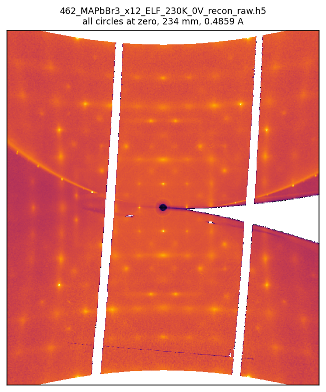

# xrays_on_detector

Simulate the single-crystal diffraction image on an area detector of a
six-circle diffractometer: given a CIF, a set of diffractometer angles, a
detector (distance, size, pixel, arm angles) and a wavelength, compute which
reflections are excited and where their spots land.

The opposite direction, from measured frames to a 3D reciprocal-space volume,
is the job of [rspace3d](https://github.com/dubajicmilos/rspace3d). This package
reads such volumes (see *Measured S(q) on the detector* below) but does not
make them.

It stitches together two pieces:

| Role | Package |
|------|---------|
| Structure factors `\|F(hkl)\|²` and reciprocal lattice (2π convention) | `xrays_on_detector.crystal`, with `single_crystal`'s Cromer-Mann table |
| Six-circle rotation matrices, You (1999) convention | diffcalc-core |

## Where each app lives

Two browser apps live in this repository, each with a Python counterpart:

| App | Browser source | Python |
|---|---|---|
| Six-circle diffractometer simulation: which reflections are excited, and where their spots land on an area detector | `web/` | `xrays_on_detector/` |
| Single-crystal diffraction from a CIF: reciprocal-lattice sections, SAED, powder | `web/sc/` | `single_crystal/` |

Both are served from <https://dubajicmilos.github.io/diffraction/>. The
single-crystal page is at <https://dubajicmilos.github.io/diffraction/single-crystal/>.

`web/sc/` imports shared modules from `web/js/`: the CIF reader
(`web/js/cif.js`), the reciprocal-lattice code (`web/js/physics.js`) and the
scattering tables (`web/js/scatter.js`), so a change there affects both apps.

The deployed site carries a copy of `web/` at `assets/diffraction/`. This
folder is the source of truth: edit here and re-sync the site from it.

## Physics

Monochromatic beam, `k = 2π/λ`, incident along the lab +y axis. The diffcalc
/ You (1999) frame is +x vertical (up), +y along the beam, +z horizontal;
`mu` and `nu` rotate about +x, `eta`, `phi` and `delta` about −z, and `chi`
about +y (the beam). So `delta` moves the detector up and down and `nu` (called
`gamma` at most beamlines) moves it left and right.

The virtual diffractometer and the browser build read the panel out in the
beam's-eye view: fast is `−z` and slow is `+x`, so `e_fast × e_slow = −arm`
and the frame displayed with column 0 on the left and row 0 at the top is what
you see standing at the sample looking downstream. That is the same picture the
3D scene shows on the detector face, and the same handedness as `realframe`.

1. Each reflection has a reciprocal-lattice point `Q = Z·U·B·(h,k,l)`, where
   `B` is the reciprocal matrix from the CIF, `U` the crystal orientation, and
   `Z = MU·ETA·CHI·PHI` the sample circles.
2. Elastic scattering: `k_f = k_i + Q`, `|k_f| = k`. The signed excitation
   error `ε = |k_i + Q| − k` measures the distance from the Ewald sphere.
3. Bragg peaks have finite size, modelled as isotropic 3D Gaussians of
   width `σ` in reciprocal space. A reflection contributes with weight
   `exp(−ε²/2σ²)`, placed along `k̂_f = (k_i + Q)/|k_i + Q|`.
4. The diffracted ray is projected onto a flat detector on the `NU·DELTA` arm;
   the finite `σ` gives each spot a finite size.

Per-reflection intensity: `I = |F|² · exp(−ε²/2σ²) · polarization(2θ)`,
rendered as a Gaussian normalised to that integrated value.

## Install

```bash
git clone https://github.com/dubajicmilos/xrays-on-detector
cd xrays-on-detector
pip install -e .
```

That gets the simulation core (`numpy`, `diffcalc-core`). The rest are extras,
so you install only what you use:

| Extra | `pip install -e ".[extra]"` | For |
|-------|------------------------------|-----|
| `vdiff` | PyQt6, matplotlib, scipy | the virtual diffractometer app |
| `singlecrystal` | PyQt6, matplotlib | the single-crystal CIF viewer app |
| `data`  | fabio, h5py, scipy | reading real frames and S(q) volumes |
| `cif`   | ase | symmetry expansion of a CIF |

`Crystal.from_cif` expands a CIF's symmetry with ASE, so it needs the `cif`
extra, unless the CIF already lists every atom of the cell and you pass
`expand_symmetry=False`. The Cromer-Mann form factors ship with the package.
Without ASE the geometry, the Ewald construction and the whole browser build
still work.

The example and validation scripts read their paths from the environment, since
no experimental data ships with the repository:

| Variable | Meaning |
|----------|---------|
| `XOD_RAW` | folder of CBF frames |
| `XOD_NAME` | run stem, so frame *n* is `<XOD_RAW>/<XOD_NAME>_01_000n.cbf` |
| `XOD_REF_H5` | reference rspace3d/CrysAlisPro volume to compare against |
| `XOD_CIF` | CIF for the superlattice example |
| `XOD_OUT` | output folder for the example and validation scripts (default `./out` beside the script); `demo.py` writes its two files next to itself |

## Usage

```python
from xrays_on_detector import Crystal, Detector, simulate_frame

crystal  = Crystal.from_cif("mystructure.cif")          # arbitrary CIF
detector = Detector(distance=120.0, n_fast=1024, n_slow=1024,
                    pixel_size=0.2, nu=0.0, delta=0.0)   # mm

frame = simulate_frame(crystal, detector, wavelength=0.7, sigma=0.04,
                       mu=0, eta=9.5, chi=0, phi=0)

frame.image      # (n_slow, n_fast) float array, ready to display or save
frame.table      # list of dicts: h,k,l, fast_px, slow_px, eps, two_theta_deg, intensity
```

Move the diffractometer by changing the sample angles (`mu, eta, chi, phi`) or
the detector (`Detector(..., nu=, delta=, distance=)`). See `examples/demo.py`
for a two-panel CsPbBr₃ example including detector motion, and a CSV export.

## Conventions

- Units: 2π reciprocal convention throughout, `|Q| = 2π/d`, with `B` in the
  standard setting (a along x, b in the xy plane). diffcalc's own `B`/`UB` use
  1/d, so only its (unit-free) rotation matrices are used here.
- Angles are in degrees; lengths (`distance`, `pixel_size`) share one unit.
- `U` defaults to identity (crystal Cartesian frame == phi frame at zero
  angles). Pass your own orientation matrix for a mounted crystal.
- Arbitrary CIFs are expanded to an explicit all-atom P1 cell with ASE before
  the structure-factor sum; `crystal.n_atoms` reports how many atoms were used.

## Validated

`tests/validate.py` checks, against analytic physics:
- detector ray projection `r = D·tan(ψ)` to ~1e-12 (machine precision);
- Ewald/Bragg self-consistency `sin θ = |Q|/2k` to ~6e-5 over hundreds of
  reflections spanning 7–77° in 2θ (NaCl, structure factors also verified:
  strong 200/220/400, weak all-odd 111, extinct mixed-parity).

## Interactive virtual diffractometer (`vdiff/`)

```bash
python -m xrays_on_detector.vdiff
```

A PyQt6 app that puts the whole forward model behind a set of motors. The left
column is the setup, the centre is a 3D view of the instrument, the right is the
simulated frame. Needs the `vdiff` extra (PyQt6, matplotlib for the colour
maps, scipy for the omega solver); the 3D is a small software renderer
(QPainter, depth sort, near-plane clip) so there is no OpenGL dependency, and
the live frame is projectively texture-mapped onto the detector face as the arm
swings.

- Detector presets: PILATUS3 100K/300K/1M/2M/6M, EIGER2 X 1M/4M/9M/16M,
  LAMBDA 750K, JUNGFRAU 1M, or type in any pixel count and pitch. Distance,
  wavelength/energy and preview binning are live.
- Motors: `mu`, `omega`(=eta), `chi`, `phi` for the sample and `delta`,
  `gamma`(=nu) for the detector arm, as sliders and spin boxes. Each row has a
  run button that turns that circle continuously, and any number of them can
  run at once; one shared signed speed sets the rate and the direction, and
  angles wrap so a circle keeps going.
- Sample: a lattice preset (runs with no CIF at all), *Load CIF ...* for
  real `|F(hkl)|²` from its atoms, or *Load S(q) ...* for a measured
  reciprocal-space volume (see below), which puts real data on the panel instead
  of calculated peaks. A *contrast* slider goes with it: measured S(q) spans
  orders of magnitude between a Bragg peak and the diffuse scattering around it.
- Orientation without writing a UB by hand. Three free-rotation sliders turn
  the crystal about the lab axes, or point a direction where you want it: *put
  (110) along the beam*, then optionally *spin about that axis until (001) is
  vertical*, which removes the leftover degree of freedom. `(hkl)` means the
  plane normal and `[uvw]` the real-space direction, which matters as soon as
  the lattice is not cubic. The resulting UB is displayed live and can be
  copied, in the 2π, 1/d or λ-scaled (CrysAlisPro) convention. The sliders
  compose on top of an alignment rather than discarding it.
- Two geometries. *Transmission* is the ordinary single-crystal rotation
  case. *Reflection* adds a sample surface with a chosen `(hkl)`: the incidence
  angle `alpha` is displayed, and any reflection whose incoming or outgoing beam
  is below the surface horizon is removed rather than drawn, which is the actual
  physical difference between the two cases.
- Drive to a reflection: type `h k l`, press *Find omega*, and it solves
  `|k_i + Q(omega)| = k` for every `omega` that puts that reflection on the
  Ewald sphere at the current `chi`/`phi`/`mu`, listing the `delta`/`gamma` the
  arm needs for each. *Drive there* moves the motors onto it.

Verified end to end: a solved `omega` lands the reflection on the Ewald sphere
to `|eps| < 1e-11 1/A`, and *Aim detector* puts it on the beam centre to
0.000 px. `examples/virtual_diffractometer.py` is the same launcher.

## Browser build: the Game of Diffraction (`web/`)

A client-side JavaScript port of the same forward model, deployed as a tab on
<https://dubajicmilos.github.io/diffraction/>. No backend: everything runs in the
visitor's browser. The physics is checked against this package by a Node harness
(`node web/test/parity.mjs`, 27 groups, machine precision). See
[web/README.md](web/README.md) for the architecture, and `tools/deploy_to_site.py`
to re-sync it into the Jekyll site after a change.

## Single-crystal patterns from any CIF (`single_crystal/`, `web/sc/`)

A separate, self-contained package for the other kind of question: not "where
does this reflection land on my detector" but "what does this structure's
diffraction pattern look like". It reads any CIF and computes:

- reciprocal-lattice sections: the undistorted plane a precession camera
  records, named by a zone axis `[uvw]` and a layer `n`, so `[100]` layer 0 is
  the *0kl* section, layer 3 the *3kl* one, and `[110]` or `[123]` are the
  diagonal cuts;
- selected-area electron diffraction: the same zone through a curved
  Ewald sphere, with a `sinc²` relrod, so the higher-order Laue zones appear;
- powder patterns, with the multiplicity summed by construction rather than looked
  up from the Laue class.

Each is available for X-rays, neutrons or electrons. Deuterium keeps its own neutron
scattering length: `b(H)` is −3.739 fm and `b(D)` is +6.671 fm, opposite in
sign, so folding D into H would invert its contribution.

```bash
python -m single_crystal structure.cif      # PyQt6 desktop viewer
```
```python
from single_crystal import read_cif, Structure, compute_section
xtal = Structure.from_cif(read_cif("rutile.cif"))   # symmetry expanded to P1
sec = compute_section(xtal, uvw=(1, 1, 0), layer=0, radiation="neutron")
```

The browser build is `web/sc/`, deployed at `/diffraction/single-crystal/`. It
shares the CIF reader and the reciprocal lattice with the Game of Diffraction
next door, and the CIF you upload never leaves your machine.

The CIF reader applies the file's symmetry operators, and the structure-factor
sum runs over the full P1 cell, so a CIF that lists only the asymmetric unit
gives correct intensities. For rutile written as its 2-site asymmetric unit
with 16 operators, summing over the listed atoms alone would put (200) out by
+353%, (101) by +71% and (211) by −26%.

Verified against pymatgen, an independent CIF reader, symmetry expansion
and form factor table, to within 1.2 on a 0-100 intensity scale on every
bundled structure, the check allowing 2.0 (`python tests/test_single_crystal.py`). The
JavaScript is held to the Python by `node web/test/parity_sc.mjs`, which agrees
to ~1e-14 over 7008 section reflections, 124 SAED reflections and 3826 powder
peaks.

## Real experimental frames (`realframe.py`)

`xrays_on_detector.realframe` simulates and indexes real rotation-method frames
on a flat on-axis detector, driven by an external UB (e.g. a CrysAlisPro /
rspace3d UB) and a single oscillation axis. Lab frame: beam +z, detector fast
+x / slow +y at `distance`; crystallographic 1/d units to match `UB/lambda`.

```python
from xrays_on_detector.realframe import FlatDetector, detect_peaks, index_frame, predict_recorded

det, angles, img = FlatDetector.from_eiger_cbf("frame_0001.cbf")   # geometry from the header
UB = ...                                    # 3x3, columns a*,b*,c* in 1/d (CrysAlis UB / lambda)
peaks = detect_peaks(img, det.beam_center)
res   = index_frame(peaks, UB, det)         # -> R, hkl, inliers, rms
hkl_rec, fast, slow, eps = predict_recorded(res.R, UB, det, hkl, osc_axis=(0, 1, 0))
```

Validated on Diamond I19-2 MAPbBr3 Eiger frames (`examples/validate_I19-2_realframe.py`):
- 8/8 observed spots on one frame indexed and predicted to ~1.6 px rms;
- frame-to-frame orientation matches the recorded phi increment to <0.11°
  (Δphi 5–30°), validating the rotation convention;
- observed spot |Q| match the reciprocal lattice to a median 0.18%.

`examples/I19-2_superlattice.py` adds the I4/mcm octahedral-tilt superlattice
for all three twin domains (|F| from a 2×2×2 CIF). On a single
0.2° still the main Bragg peaks are ~80% detectable, and predicted-|F|² vs
measured superlattice intensity correlate at ~+0.6 to +0.7 (faint superlattice
shows up far more clearly in the integrated 3D reconstruction than on one still).

## Measured S(q) on the detector (`sqvolume.py`)

The reverse of what a reconstruction (rspace3d, CrysAlisPro) does. That turns
a series of detector frames into a 3D reciprocal-space volume; this reads
such a volume back and asks what a detector would record from it. Every pixel is
mapped to a point in reciprocal space and the volume is interpolated there, so
Bragg peaks, superlattice peaks and diffuse scattering all appear wherever the
Ewald sphere cuts the measured data.

```python
from xrays_on_detector.sqvolume import SqVolume, project_volume

vol = SqVolume.from_h5("MAPbCl3_133K_sym_mmm.h5")   # rspace3d / CrysAlisPro
image, coverage = project_volume(detector, vol, wavelength=vol.wavelength,
                                 ZUB=Z @ U @ B)      # sample circles, U, B
```

For a pixel whose outgoing unit direction is k̂, the scattering vector is
Q<sub>lab</sub> = k (k̂ − beam) with k = 2π/λ, and the volume is sampled at
hkl = (Z·U·B)<sup>−1</sup> Q<sub>lab</sub>: the same Z·U·B product that places a
calculated reflection, read backwards.



*A MAPbBr₃ volume measured at 230 K on I19-2 and reconstructed with rspace3d,
projected onto a flat detector 234 mm from the sample with all circles at
zero (output of `examples/project_sq_volume.py`). Bragg peaks and diffuse
streaks appear where the Ewald sphere cuts the data; white areas were not
measured in the source volume. The strongest measured peak lands 1.4 px from
the pixel that the six-circle model predicts.*

In the app it is *Load S(q) ...* (or start on one with
`python -m xrays_on_detector.vdiff --sq VOLUME.h5`), and then the motors sweep
the measured data across the panel exactly as they sweep calculated peaks. Needs
`h5py`. `examples/project_sq_volume.py` does the same headless, from `XOD_SQ_H5`.

A volume over ~200 M voxels is block-averaged by an integer factor as it is
read, so a 5.9 GB raw reconstruction opens as 839×737×300 in about 20 s; the
factor is reported, never applied quietly. The file's own wavelength is adopted
on load, since that is the sphere the data were collected on.

Four things worth knowing:

- The file's UB is used for the cell, never as an orientation. A CrysAlisPro
  UB lives in CrysAlisPro's own frame, which differs from this lab frame by a
  fixed rotation the file does not record. So the volume arrives as a lattice
  with `U = I` and you orient it as usual.
- Coverage is reported, and it is usually not 100%. A reconstruction covers a
  box a few r.l.u. wide, and a short wavelength makes the Ewald sphere flat: at
  72 keV a ±6 r.l.u. volume subtends only ~10° in 2θ, so at 200 mm it lands in a
  small central disc and the rest of the panel reads zero for want of data, not
  of scattering. *Move detector back to fit the volume* solves for the distance
  that spreads the data across the panel (~690 mm in that case).
- No polarisation or obliquity factor is applied. The volume already holds
  measured intensity; multiplying it by a Thomson factor would add a distortion
  rather than remove one.
- Holes in the source volume come through as holes. rspace3d's CrysAlisPro
  unwarp route writes an unmeasured voxel as 0, not NaN, so a *raw*
  (unsymmetrised) reconstruction from it still
  carries the original detector's module gaps and the beam stop, and they
  reappear on the simulated panel as zero-valued stripes cutting across it at
  whatever angle the Ewald sphere now meets them. That is the data, not a bug;
  a symmetry-averaged volume has them filled in. Volumes from rspace3d's
  raw-frame reconstruction (`rspace3d.rawrecon`) do use NaN, and those voxels
  are read as zero with the fraction reported.

Validated (`python tests/test_sqvolume.py`): trilinear sampling is exact on a
linear field; the pixel → hkl → pixel round trip agrees with `Detector.project`
to ~5e-14 px over three arm positions, so the projected image lines up with the
rendered spot overlay; planted peaks land on the six-circle model's predicted
pixel to <0.6 px, on and off the beam centre. On real I15 MAPbCl₃ data the
strongest measured Bragg peaks land 0.46 voxel from the prediction, which is the
half-voxel registration of the reconstruction's own grid, not an error here.

## Current scope and limits

Built: monochromatic, single frame, You six-circle, Gaussian peaks.
Not yet (natural extensions):
- rotation series / oscillation movies as circles sweep;
- Lorentz factor for integrated (rotation) intensities; only polarization is
  applied to a still;
- structure factors ignore anomalous dispersion (f′, f″) and use isotropic B;
- mosaic / anisotropic peak shapes, and polychromatic (Laue/pink) beam;
- UB refinement from reference reflections (diffcalc can supply this).

## Licence

MIT, see [LICENSE](LICENSE). The bundled Cromer-Mann coefficients under
`single_crystal/data/` and `web/data/` are the published values of
International Tables for Crystallography Vol. C; check that provenance before
redistributing them under a different licence.

The neutron scattering lengths (`single_crystal/data/`, mirrored into
`web/data/`) come from pymatgen, which is MIT-licensed like this project.
The electron scattering factors are the five-Gaussian fit of Peng, Ren, Dudarev
and Whelan (1996, Acta Cryst. A52, 257), published as International Tables for
Crystallography Vol. C, Table 4.3.2.3: physical constants, which carry no
licence of their own. `tools/export_scattering.py` reads them from `diffsims`'
transcription of that table (diffsims is GPLv3; none of its code is used or
copied and it is not a dependency), checks every entry against the Mott-Bethe
transform of the independent X-ray table, and refuses to write a table that
fails the check. Nothing is refitted. The exporter can repair the older
four-Gaussian Doyle-Turner table that pymatgen ships, whose tin entry is
wrong, but that table is not the one used.
